# Домашнее задание 07. "Загрузка системы"

## Домашнее задание.

1. Попасть в систему без пароля несколькими способами.
2. Установить систему с LVM, после чего переименовать VG.
3. Добавить модуль в initrd.

## Выполнение.

### 1. Попасть в систему без пароля несколькими способами.

Запускаем виртуальную машину и при выборе ядра для загрузки нажимаем **Е**.
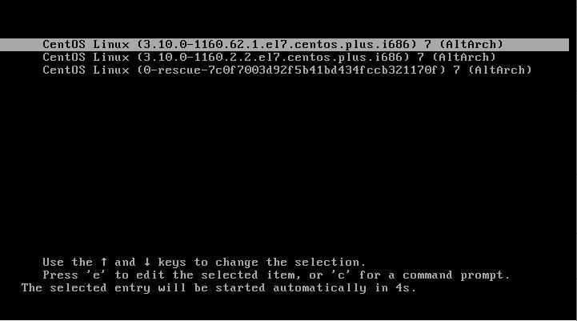

#### Способ 1. init=/bin/sh
В конце строки начинающейся с linux16 добавляем init=/bin/sh и нажимаем сtrl-x для загрузки в систему.

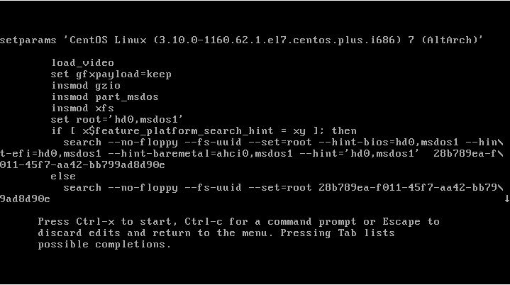

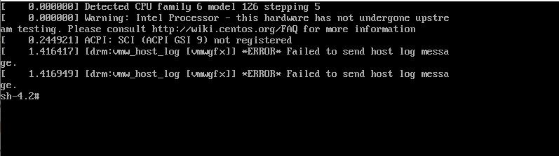

Перемонтируем файловую систему в режим Read-Write воспользовавшись командой 
```
mount -o remount,rw /
```

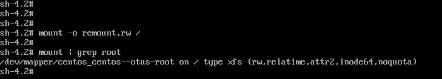

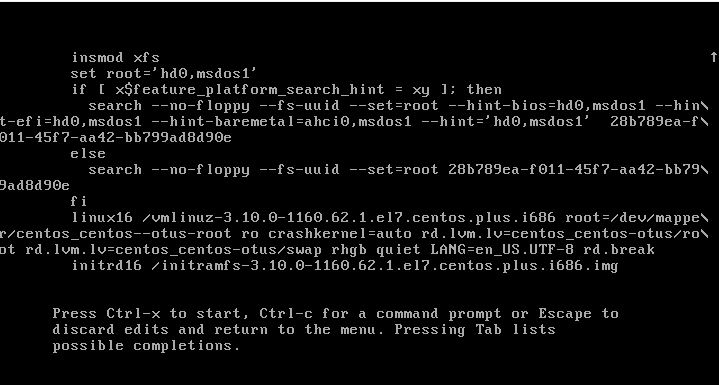

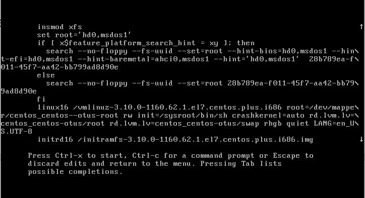

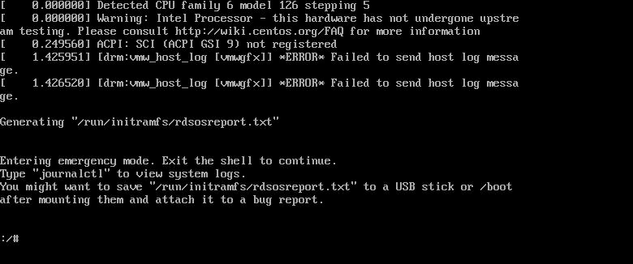

### 2. Установить систему с LVM, после чего переименовать VG.

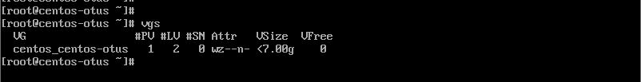


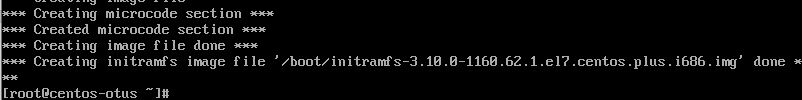

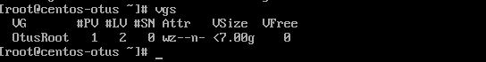

### 3. Добавить модуль в initrd.

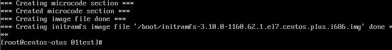

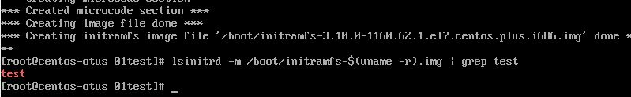

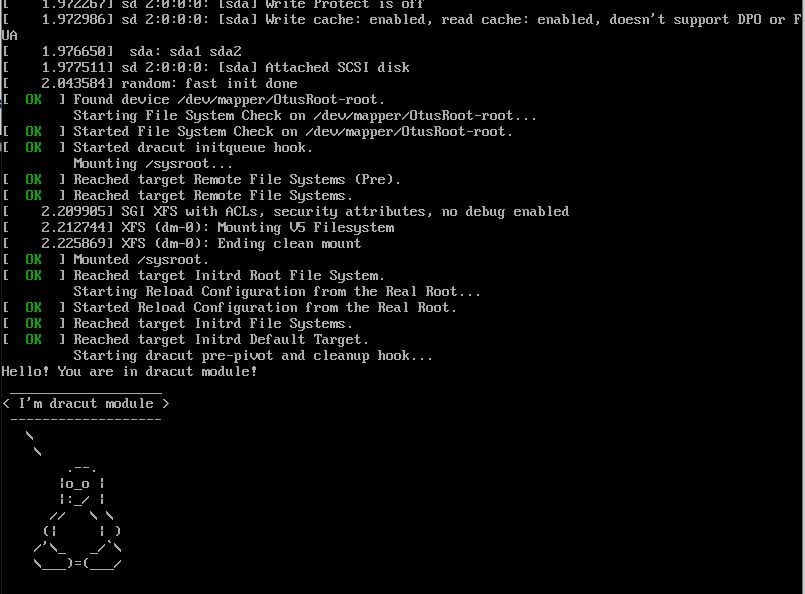
