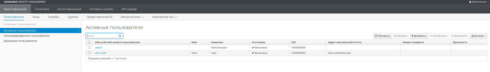

# Домашнее задание 24. "LDAP"

## Домашнее задание.

1. Установить FreeIPA на сервер;
2. Написать Ansible playbook для конфигурации клиента.


## Выполнение.

Результатом выполнения домашнего задания является [Vagrantfile](Vagrantfile) файл, который средствами ansible provisioning подготавливает следующий стенд:
-    IPA сервер ipaserver.otus.lan - 192.168.57.10
-    Клиентский сервер ipaclient.otus.lan - 192.168.57.11


### Проверка работы LDAP:

- На сервере **ipaserver.otus.lan** создаем пользователя *otus-user*:

```
[root@ipaserver ~]# kinit admin
Password for admin@OTUS.LAN: 

[root@ipaserver ~]# ipa user-add otus-user --first=Otus --last=User --password
Password: 
Enter Password again to verify: 
----------------------
Added user "otus-user"
----------------------
  User login: otus-user
  First name: Otus
  Last name: User
  Full name: Otus User
  Display name: Otus User
  Initials: OU
  Home directory: /home/otus-user
  GECOS: Otus User
  Login shell: /bin/sh
  Principal name: otus-user@OTUS.LAN
  Principal alias: otus-user@OTUS.LAN
  User password expiration: 20230824083646Z
  Email address: otus-user@otus.lan
  UID: 1509400003
  GID: 1509400003
  Password: True
  Member of groups: ipausers
  Kerberos keys available: True
[root@ipaserver ~]# 
```

Через веб-форму убеждаемся в появлении нового пользователя:




- На клиентской машине **ipaclient.otus.lan** задаем пароль пользователю и проверяем возможность подключения:
```
[root@ipaclient ~]# kinit otus-user
Password for otus-user@OTUS.LAN: 
Password expired.  You must change it now.
Enter new password: 
Enter it again:

[root@ipaclient ~]# su - otus-user
Creating home directory for otus-user.

[otus-user@ipaclient ~]$ 
[otus-user@ipaclient ~]$ pwd
/home/otus-user
```
